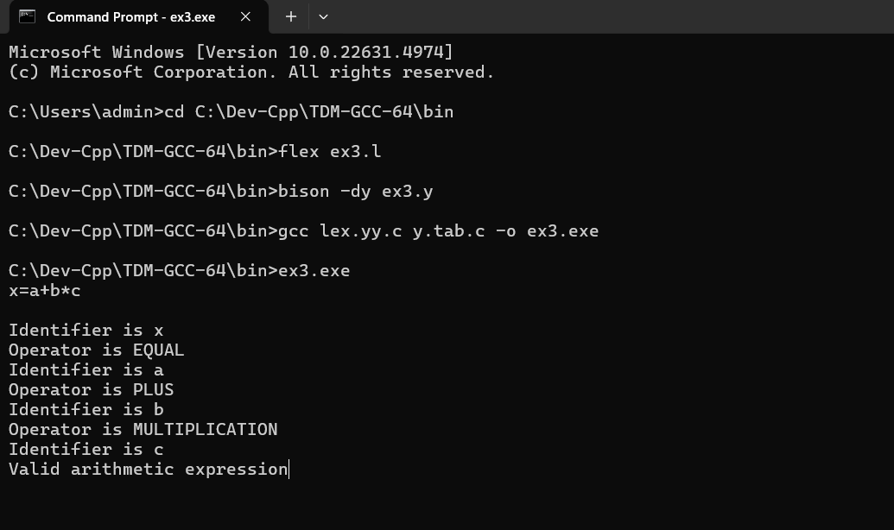

# Ex-3-RECOGNITION-OF-A-VALID-ARITHMETIC-EXPRESSION-THAT-USES-OPERATOR-AND-USING-YACC
# Date: 30/4/2024
# AIM
To write a yacc program to recognize a valid arithmetic expression that uses operator +,- ,* and /.
# ALGORITHM
1.	Start the program.
2.	Write a program in the vi editor and save it with .l extension.
3.	In the lex program, write the translation rules for the operators =,+,-,*,/ and for the identifier.
4.	Write a program in the vi editor and save it with .y extension.
5.	Compile the lex program with lex compiler to produce output file as lex.yy.c. eg $ lex filename.l
6.	Compile the yacc program with yacc compiler to produce output file as y.tab.c. eg $ yacc –d arith_id.y
7.	Compile these with the C compiler as gcc lex.yy.c y.tab.c
8.	Enter an arithmetic expression as input and the tokens are identified as output.
# PROGRAM
## ex3.l file
```
%{
#include "y.tab.h"
#include <stdio.h>
%}

%%

"="                     { printf("\nOperator is EQUAL"); return '='; }
"+"                     { printf("\nOperator is PLUS"); return PLUS; }
"-"                     { printf("\nOperator is MINUS"); return MINUS; }
"/"                     { printf("\nOperator is DIVISION"); return DIVISION; }
"*"                     { printf("\nOperator is MULTIPLICATION"); return MULTIPLICATION; }
[a-zA-Z][a-zA-Z0-9]*    { printf("\nIdentifier is %s", yytext); return ID; }
\n                      { return 0; }
.                       { return yytext[0]; }

%%

int yywrap() {
    return 1;
}
```

## ex3.y file
```
%{
#include <stdio.h>

// Declarations required to resolve compiler warnings/errors
int yylex();                // Declaration of yylex
void yyerror(char *s);     // Declaration of yyerror

/* This YACC program is for recognizing an arithmetic expression */
%}

%token ID PLUS MINUS MULTIPLICATION DIVISION

%%

statement:
    ID '=' E {
        printf("\nValid arithmetic expression");
        $$ = $3;
    }
;

E:
      E PLUS ID
    | E MINUS ID
    | E MULTIPLICATION ID
    | E DIVISION ID
    | ID
;

%%

extern FILE* yyin;

int main() {
    do {
        yyparse();
    } while (!feof(yyin));
    return 0;
}

void yyerror(char *s) {
    fprintf(stderr, "Error: %s\n", s);
}
```

# OUTPUT


# RESULT
A YACC program to recognize a valid arithmetic expression that uses operator +,-,* and / is executed successfully and the output is verified.
